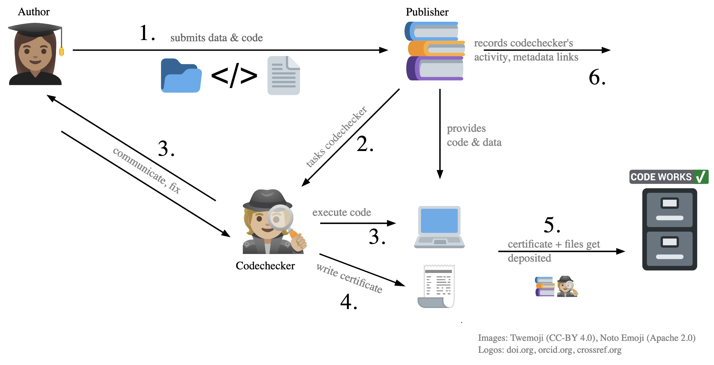
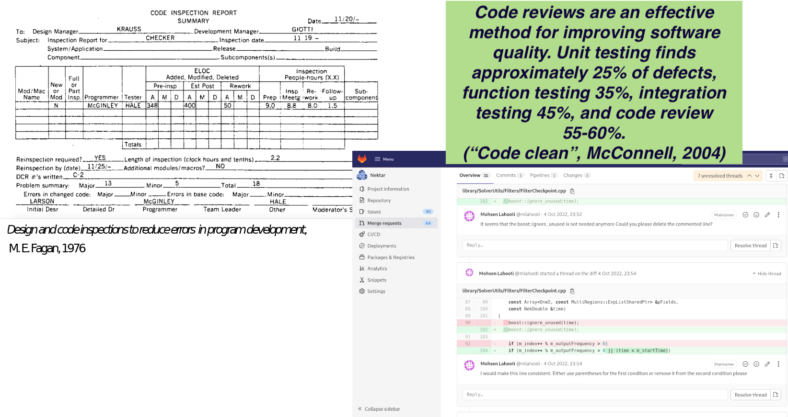
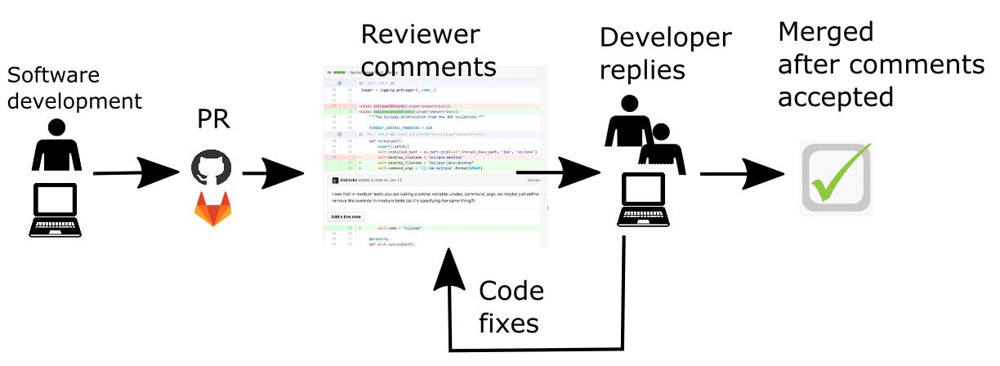
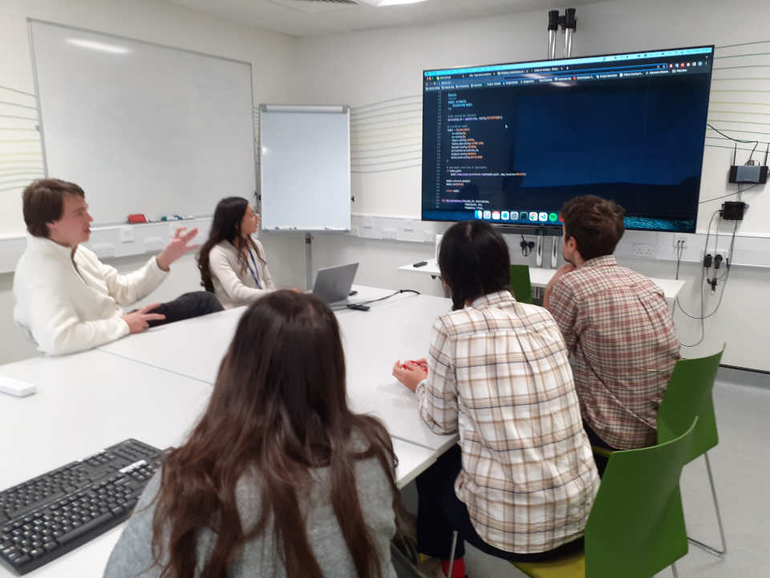
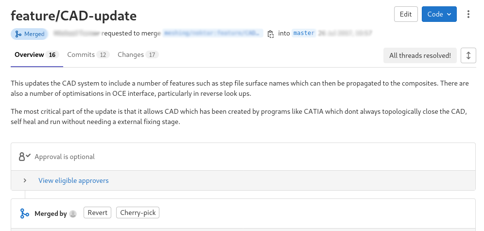
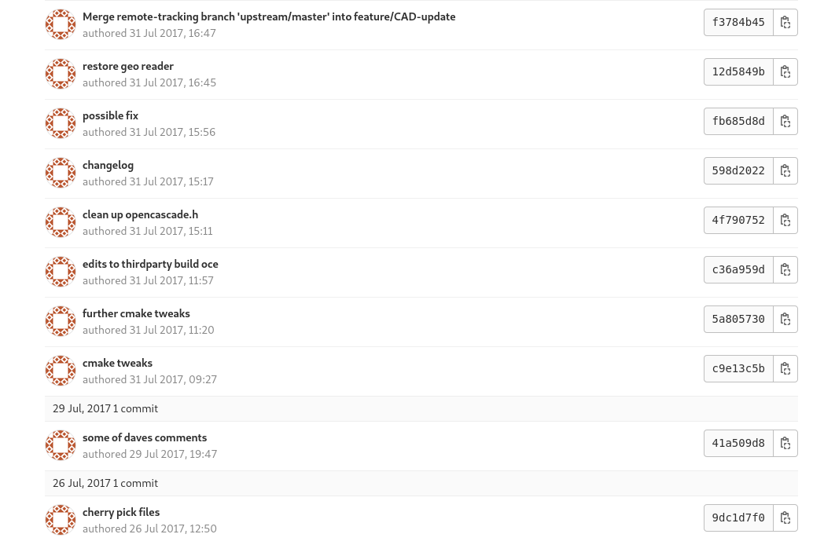

### Part 0

<h3>What is a code review?</h3>


### Code review?

Main benefits:

(1) Catching bugs

(2) Ensuring quality standard

(3) Spreading knowledge

(4) Training new developers


::: notes

-   Viewed as an important practice in the software industry.
-   Key step in contributing to most software projects (gatekeeping).

:::

### Not a peer review for code

-   Code review **throughout the research process**:
    -   Frequent
    -   Informal
    -   Low stakes
-   Commonly referred as "Modern Code Review" in the SE literature.
    Bachelli and Bird 2013
-   Can be _asynchronous_ (GitHub's Pull Requests) or _synchronous_ (in
    person chat).

### CODECHECK



### From formal inspections to code review



### Asynchronous Code Review



### Synchronous Code Review

{width=65%}

<p style="font-size: 0.5em">Elise Özalp, Yaxin, Defne Ozan, Daniel Kelshaw
[(https://magrilab.ae.ic.ac.uk)](https://magrilab.ae.ic.ac.uk/group.html),
Thibault Lestang. Photo cred: Neil Montague.</p>
<p style="font-size: 0.4em">Department of Aeronautics, Imperial College London</p>

### Two contexts

1.  Individual developers writing their own specific software.
2.  Developers collaborating on a common codebase.
    -   Code review as gatekeeping.

### Research on code reviews

*Modern Code Review: A Case Study at Google* (Sadowski, 2018)

*Expectations, Outcomes, and Challenges of Modern Code Review*
(Bacchelli and Bird, 2013)

*Code Reviewing in the Trenches: Understanding Challenges and Best
Practices* (McLeod et al, 2017)

*Code review by and for scientists* (Petre & Wilson, 2014)

### Part 1 {background-color="#002147" transition="zoom"}

Benefits of code reviews for research software

### Code review for software quality {background-color="#002147"}

1.  Defects
2.  Code improvements


::: notes

If you ask Microsoft developers about why they are doing code reviews,
you'll find that the main motivation is making the code better. This
means identifying defects and improving the code.

Code improvements are changes that do not affect the functionalities
but make the code more readable or maintainable. You can think of
complying to a naming scheme, identifying code smells, or adhering to 
existing software design choices.

:::

### Code review for software quality {background-color="#002147"}


::: notes

In practice, defects aren't the first thing that code review really
help with. It can help, but maybe testing is a better investement in
order to prevent bugs.

But code review is clearly effective for improving code.

:::

### Code reviews for understandability {background-color="#002147"}

More often than not source code is the only available form of documentation.

Understandability is key for **code reuse** and **transparency**.

::: notes

Understanbility goes beyond readability, it measures how easy it is to get
comfortable making changes to a software system. Understandability is a prime
quality for research software.

If you think of a research group in which researchers write their own bespoke
programs for their specific data manipulation or computational experiement,
these will not be documented.

Code review is a good assessment of understandability and this makes
it very attractive for research software.

:::

### Code reviews for team awareness {background-color="#002147"}

-   Continuous knowledge exchange.
-   Enhanced collaboration.
-   Longer term resilience of project(s) (Bus factor!).

::: notes

Code review goes beyond understability. Esp important in research where
developers may be more isolated from each other and it's easy to struggle and
come up with your own bespoke solutions.

:::

### Code reviews for team awareness {background-color="#002147"}

{width=65%}

<p style="font-size: 0.5em">Elise Özalp, Yaxin, Defne Ozan, Daniel Kelshaw
[(https://magrilab.ae.ic.ac.uk)](https://magrilab.ae.ic.ac.uk/group.html),
Thibault Lestang. Photo cred: Neil Montague.</p>
<p style="font-size: 0.4em">Department of Aeronautics, Imperial College
London</p>

::: notes

Imperial story
- Handful of PhD students, all training ML models
- Need to read in and manage many different parameters
- Through code review became obvious they are all trying to do similar thing.
- Working together to come up with a shared solution.
- Common, standardized way of dealing with model parameters that they all
  understand. They will benefit from that over the course of their PhD.

Code review had an indicrect impact: people talk to each other more.

:::

### Code reviews for knowledge transfer {background-color="#002147"}

Code review is peer learning.

- Spread of good practices.
- Homogeneisation of styles and practices.

. . .

```python
filepath = "/my/own/specific/path/" + "data.csv"
```

. . .

```python
from pathlib import Path
# ...
datadir_path = Path("/my/own/specific/path/")
filepath = datadir_path / "data.csv"
```

::: notes

If the Bachelli sutdy was carried out in a lab, knowledge transfer would be
huge. Because knowledge is very unevenly distributed in research.

Use of a yaml input file
Dataclasses

:::

### Part 2: Challenges {background-color="#e4e4e4" transition="zoom"}

A lot of good practices around...

...but what about **research software**?

::: notes

The elephant in the room: nobody does code review.  Some may do it as part of
collaborating on a distributed project.

Generally within a research group or a lab/department, for the reasons above
this is not happening.

:::

### Code review is time and energy {background-color="#e4e4e4"}

Two complementary courses of actions:

::: incremental

-   Regularly reflect on process and follow trusted practices.
-   Acknowledge code review as a worthy investment:
    -   "middle-term" benefits for individuals.
    -   Short and long term benefits for collectives.

:::

. . .

**Large return on investment**

::: notes

It's a fact but both time and energy investement can be reduced.

One prerequisite of code reivew is being okay with somebody looking
your code.

:::

### Being protective about code {background-color="#e4e4e4"}

1. There can be some unhealthy competition going on.
2. A large number of researchers feel shy about their coding practices:

-   Lack of training.
-   Other priorities, often structural (e.g. funding).
-   Why would I share my code if nobody else does?

. . .

Code review can put software (back?) at the heart of the collaborative
scientific process.

::: notes

shame is perhaps the biggest issue. From my modest 5 years exp as a full time
RSE, I've worked with researchers in various and often feel ashamed of their
coding practice. Several factors: lack of training, code is an afterthought,
not used to share code. Code review can help turn the tide.

:::

### Strong heterogeneity among team members {background-color="#e4e4e4"}

-   Experience.
-   Skills (*e.g.* programming languages).
-   Interest & motivation.

::: notes

Code review litterature reports on the effect of heterogeneity among
participants who can be very junior developers up to employees with more than
10 years experience int he software industry or even the same company. They
share common skill base, vocabulary, interest in SE.

But in research this is a whole other level of heterogeneity.

:::

### Other challenges {background-color="#e4e4e4"}

- Finding reviewers.
- Finding guidance or mentors.

### Part 3: Code review good practices {background-color="#a5f99e" transition="zoom"}

A lot of the good practices from software engineering industry are applicable,
**with a pinch of salt**.

::: notes

The following results from combination of industry good practice and
observations/experimentation in a research context.

:::

### Keep it short {background-color="#a5f99e"}

3 times 30' instead of one time 90'

-   Fit in a busy schedule.
-   Doesn't feel like a big commitment.
-   Code review can be a very demanding activity.

Remember that software is often not the primary driver.

### Avoid comfort mode {background-color="#a5f99e"}

*That doesn't look right but I guess that's okay...*

*I just must have missed something...*

. . .

In code review meetings, authors should make is easy for reviewers to
interject.

::: notes

It can be hard for more shy people to dare interject and ask
questions. Especially if they have less experience than the author.

Easy to think reviewers have all the responsability but actually authors have a
huge impact on the code review success.

:::

### The author's part {background-color="#eaaeb5"}



### The author's part {background-color="#eaaeb5"}



### The author's part {background-color="#a5f99e"}

-   Keep it small! (~30').
-   Provide a description of the purpose and structure of the code.
-   Think ahead what reviewers will and will not be familiar with
    -   Specific libraries?
    -   Specific domain knowledge?
-   Ensure minimum quality standard (*e.g.* style, naming).

As a reviewer, think from your reviewer(s)' perspective.

::: notes

A code review's success partly rests on the author's shoulder.  Authors are not
entirely responsible for the review success, but can definetely make it fail.

Extra effort for everyone in the team, but goes faster as a whole. Also makes
life easier for everyone - offsets initial effort.

:::

### Specify the feedback you are after {background-color="#a5f99e"}

*I'm not happy with this loop*

```bash
for i in `seq 1 $NUMOFFIG`
do
  FIG=$(ls $IMDIR | head -n $i | tail -n 1)
  echo "    ${placeholderpath}/${FIG}" >> $FILE
done
```

. . .

*I'm having to define a lot of classes that don't do much, what do you
think of my design?*

. . .

*I don't have any specific issue in mind, but I'm curious to see
whether or not you find it hard to to follow the code's logic.*

::: notes

Feedback is likely to be more targeted and impactful.

:::

### Define (and enforce) a scope {background-color="#a5f99e"}

Example default scope: understandability

-   Obscure variable names.
-   Complex conditionals.
-   Duplicated code.
-   Long parameter lists.
-   Shallow modules.
-   ~~Standard compliance.~~
-   ~~Performance sinks~~.
-   ~~Security concerns~~.

Default scope can be overrriden at will.

::: notes

Another way to foster relevant feedback and discussions is to define a scope.

:::

### Whether "it works" or not is irrelevant {background-color="#a5f99e"}

- Code review is not an evaluation of a finished product.
- It is more rewarding to look at code that is WIP.
- The only expectation is that code is readable by reviewers.

::: notes

-   Formatting, dead code, comments...

:::


### Make it formal -- but safe {background-color="#a5f99e"}

Code review is more effective with a clear process (formal)

*At the same time,*
Code review *must* occur within an inclusive and supporting space.

**It's about creating an environment where people feel confident about
discussing their code with each other.**

### Overheard in the next meeting room {background-color="#eaaeb5"}

Author: *This loop I wrote looks too complicated to me.*

. . .

Reviewer: *Hmmm yes. You could just use a pipe and `xargs`.*

. . .

Author: *What's `xargs`?*

. . .

Reviewer: *It's basically mapping a command over a set of inputs - think
functional programming!*

. . .

Author: *&#x2026;*

. . .

Reviewer: *Alhtough you could also do the same thing with `sed`.*

. . .

Author (looking frustrated): *I have no idea what you're talking about.*

### All feedback isn't helpful {background-color="#a5f99e"}

...at least for now.

Reviewers with more programming experience/enthusiasm must be
careful not to overwhelm beginners.

### Use a checklist {background-color="#a5f99e"}

-   [ ] Poor formatting.
-   [ ] Dead code.
-   [ ] Missing documentation.
-   [ ] Obscure names.
-   [ ] Complex conditionals.
-   [ ] Obscure one-liners.
-   [ ] Duplicated code.
-   [ ] Long procedures.
-   [ ] Long parameter lists.
-   [ ] Global state.
-   [ ] Abuse of primitive types.
-   [ ] Data clumps.
-   ...

::: notes

Give an opportunity for beginners to participate.

Start with the easy checks.

:::

### Critique the code, not the programmer {background-color="#eaaeb5"}

*You clearly made little effort in naming things&#x2026;*

*You should name this differently*

*This doesn't make sense*

::: notes

Feedback can be hard to stomach

:::

### Giving feedback is not trivial {background-color="#a5f99e"}

1.  Own you opinions.
2.  Make it about the code.
3.  Be specific.
4.  Suggest an alternative.

. . .

~~*This name doesn't make sense*~~

. . . 

*I think this function's purpose would be much clearer if it was given
a more explicit name.. perhaps `apply_bwd_transform`?*

### Code review is both **technical** and **social** {background-color="#a5f99e"}

Code reviews can drive both inclusion and exclusion.

. . .

> A bad reviewer tries to force their preference on you. A good code
> reviewer makes your code conform to certain principles, but not
> opinion. (*Quote from survey participant from Greiler, 2016*)

### Define (and refine) a policy {background-color="#a5f99e"}

-   Well defined process.
-   Default scope.
-   Moderator(s).
-   Code of conduct.
-   Conflict resolution.

::: notes

A code reviwe is a conversation, potentially involving more than 2 people. as
any converstaion it can shift to irrelevant topics, unproductive arguments or
power struggles.

A clear policy including moderation and conflict resolution procedures can
guard against these.

:::


### A culture of openess and collaboration {background-color="#a5f99e"}

- Components of a successful software project are
  + Code
  + People
  + Communication
- Research code review goes along with collective ownersip of research project.

### Code Review at Anaconda

::: notes

Anaconda  is well-known in the Data Science community for its contribution to open source projects and the PyData ecosystem - in fact Anaconda sutains NumFOCUS which is the non-profit umbrella organisation supporting the main projects in Python Scientific Ecosystem. 

As a company, Anaconda is a  _RemoteFirst_ organisation

fully-distributed teams set to work asynchronously (w/ timely sync catch ups)

:::

### Code Review at Anaconda

(_Asynch_) **Code Review** plays a huge role in Anaconda

. . . 

- Code review is a standard practice in all projects being used to:

	+ Enforce Team collaboration
	+ Provide a welcoming and friendly  _onboarding_ for newcomers 	
	+ Guarantee Software compliance (_audit_)

. . .

- Code Review sets and (easily) adapts differently depending on specific Projects requirements

. . . 

- The type of the team is very important, for example:

	+ All IT-experts; IT people w/ diff experience or backgrounds; IT & non-IT people.. 

### Code Review at Anaconda

(Author's Checklist)

- **Always** communicate up-front changes to an existing code base, i.e. _Open an Issue in the repo_

	+ This also works well because GH allows to refer & close related issues in a PR
	+ Helps also with changes already discussed / in progress

. . . 

For new-comers:

- Always start with _small_ and self-contained things to easily get into the project and the process 	 

### Code Review in Anaconda

(Reviewer's Checklist)

- TOP of the list: Being considerate; giving recommendations, and motivations (_why!_)

. . . 

Code Review is mostly based on integration and (generally) _non-functional_ requirements: 

. . .  

- Check that (design) _concepts_ are not broken (e.g. APIs);
- All changes are supported by automated tests;
- Code organisation is compliant with project structure; 
- _concistency_ (code and data) is respected wrt. to the project;
- Suggest _more efficient // Pythonic_ implementations (if any)

	+ Ignore all things that could be automated, e.g. via linters. 

::: notes

(Top list) This means that code review is generally carried out by more experienced engineers first, with sometimes junior engineers being asked to assist
Explaining motivations of comments is extremely important and it is what is primarly considered as a good and considerate CR

:::

### Thank you!

Questions?
