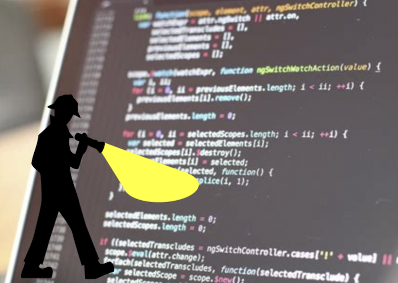

# What is a code review?

# Code review?

Main benefits:
-   Catching bugs
-   Ensuring quality standard
-   Spreading knowledge
-   Training new developers

> **Code reviews are an effective method for improving software quality. Unit testing finds approximately 25% of defects, function testing 35%, integration testing 45%, and code review 55-60%.** (McConnell, 2004)

::: notes

-   Viewed as an important practice in the software industry.
-   Key step in contributing to most software projects (gatekeeping).

:::

# Not a peer review for code

-   Code review **throughout the research process**:
    -   Frequent
    -   Informal
    -   Low stakes
-   Commonly referred as "Modern Code Review" in the SE litterature.
    Bachelli and Bird 2013
-   Can be asynchronous (GitHub's Pull Requests) or synchronous (in
    person chat).

# CODECHECK

# Two contexts

1.  Individual developers writing their own specific software.
2.  Developers collaboratin on a common codebase.
    -   Code review as gatekeeping.

# Research on code reviews

*Modern Code Review: A Case Study at Google* (Sadowski, 2018)

*Expectations, Outcomes, and Challenges of Modern Code Review*
(Bacchelli and Bird, 2013)

*Code Reviewing in the Trenches: Understanding Challenges and Best
Practices* (McLeod et al, 2017)

*Code review by and for scientists* (Petre & Wilson, 2014)

# Code review for software quality

1.  Defects
2.  Code improvements

::: notes

If you ask Microsoft developers about why they are doing code reviews,
you'll find that the main motivation is making the code better. This
means identifying defects and improving the code.

Code improvements are changes that do not affect the functionalities
but make the code more readable or maintainable. You can think of
complying to a naming scheme, identifying code smells.

:::

# Code review for software quality

::: notes

In practice, defects aren't the first thing that code review really
help with. It can help, but maybe testing is a better investement in
order to prevent bugs.

But code review is clearly effective for improving code.

:::

# Understandability matters

Oftentimes source code is the only available docs..

::: notes

Code review is a good assessment of understandability and this makes
it very attractive for research software. If you think of a research
group in which researchers write their own bespoke programs for their
specific data manipulation or computational experiement, these will
not be documented.

Understandability becomes a prime quality for research software. 

:::

# Knowledge transfer

Code review is a peer learning activity.

-   Spread of good practices.
-   Homogeneisation of styles and practicess across group.

    filepath = "/my/own/specific/path/" + "data.csv"

    from pathlib import Path
    # ...
    filepath = datadir_path / Path(datafile)

# Better team awareness

Even if not working on *exactly* the same project, regular code
reviews enable awareness of what others are doing.

-   Continuous knowledge exchange
-   Enhanced collaboration
-   Longer term resilience of project(s) (Bus factor!)

# Code review is challenging

A lot of content available, but what about **research software**?

# Code review is time and energy

It's a fact.

Two complementary courses of actions:

-   Acknowledge code review as a worthy investement:
    -   "middle-term" benefits for individuals.
    -   Short and long term benefits for collectives.
-   Regularly reflect process and follow good practices.

. . .

**Large return on investment**

# Being protective about code

There can be some unhealthy competition going on.

A large number of researchers feel shy about their coding practices:

-   Lack of training.
-   Other priorities, often systemic (e.g. funding).
-   Why would I share my code if nobody else does?

Code review can turn the tide by putting software (back?) at the
heart of scientific process.

::: notes

One prerequisite of code reivew is being okay with somebody looking
your code. Not only looking but judging it against some quality
standards.

I've worked with researchers in various and often feel ashamed of
their coding practice. Several factors: lack of training, code is an
afterthought, not used to share code. Code review can help turn the
tide.

:::

# Strong heterogeneity among team members

-   Experience.
-   Skills (*e.g.* programming languages).
-   Interest & motivation.

::: notes

Code review litterature reports on the effect of heterogeneity among
participants who can be very junior developers up to employees with
more than 10 years experience int he software industry or even the
same company.

But in research this is a whole other level of heterogeneity.

:::

# Finding reviewers

What about "lone coders"?

# Bad experiences

Code review can lead both to inclusion and exclusion.

Dual nature: both **technical** and **social** practice.

# Bad experience 2

Most common code review parasites are:

-   Irrelevant feedback.
-   Petty arguments decoupled from overall scientific goal.
-   Power struggles.

These must be and active effort to keep these under control. Similar
to technical debt.

> A bad reviewer tries to force their preference on you. A good code
> reviewer makes your code confrom to certain principles, but not
> opinion.

# Lack of guidelines

Where we start?

# Code review good practices

-   Most good practices from software engineering industry are
    applicable.
-   Some of them for slightly different reasons
-   The following is an account of my personal experience and
    discussions with colleagues - not evidence-based conclusions.

# Short meetings

3 times 30' instead of one time 90'

-   Fit snuggly in the diary.
-   Doesn't feel like a big commitment.
-   Code review can be a very demanding activity.

# Engage with the review

It's easy for participants to fall into "comfort mode"

-   Author describes goes through code as if logic and implementation is
    obvious.
-   Reviewers assume author "know what they are doing".

Reviewers should **never stop questionning** and trying to understand the code

Authors should **give reviewers opportunities to interject**.

# Let authors be aware of their responsabilities

A code review's success partly rests on the author's shoulder.

-   Choose a small piece of code.
-   Provide a description of the purpose and structure of the code.
-   Think ahead what reviewers will and will not be familiar with
    -   Specific libraries
    -   Specific domain knowledge
-   Ensure minimum quality standard (*e.g.* style, naming)

Put yourself into your reviewer(s)' shoes: what would you want to be
told if asked to review your code?

# Let authors specify the feedback they are after

Feedback is likely to be more targeted and impactful.

*I'm not happy with this loop*

    for i in `seq 1 $NUMOFFIG`
    do
        FIG=$(ls $IMDIR | head -n $i | tail -n 1)
        echo "    ${placeholderpath}/${FIG}" >> $FILE
    done

*I'm having to define a lot of classes that don't do much, what do you
think of my design?*

*I don't have any specific issue in mind, but I'm curious to see
whether or not you find it hard to to follow the code's logic.*

# Define (and enforce) a scope

Example default scope: understandability

-   Poor formatting.
-   Obscure variable names.
-   Complex conditionals.
-   Long functions.
-   Long parameter lists.
-   ~~Design red flags~~.
-   ~~Performance sinks~~.
-   ~~Security concerns~~.

Default scope can be overrriden at will.

# Whether "it works" or not is irrelevant

Code review is not an evaluation of a finished product.

It is more rewarding to look at code that is WIP or causing
difficulties.

The only expectation is that code is readable by reviewers:

-   Formatting, dead code, comments...

# Make it formal but safe

Code review is more effective with a clear process (formal)

*At the same time,*
Code review meetings *must* remain inclusives and supporting spaces.

**It's about creating an environment where people feel confident about
discussing their code to each other.**

# Overheard in the next meeting room

Author: *This loop I wrote looks too complicated to me.*

Reviewer: *Hmmm yes. You could just use a pipe and `xargs`.*

Author: *What's `xargs`?*

Reviewer: *It's basically mapping a command over a set of inputs.*

Author: *&#x2026;*

Reviewer: *Alhtough you could also do the same thing with `sed`.*

Author: *I have no idea what you're talking about*

# All feedback isn't helpful

At least for now.

Esp. reviewers with more programming experience/enthusiasm must be
careful not to overwhelm beginners.

# Critique the code, not the programmer

Feedback can be hard to stomach

*You clearly made little effort in naming things&#x2026;*

*You should name this differently*

*I think this name is misleading*

# The art of giving feedback

1.  Own you opinions.
2.  Make it about the code.
3.  Be specific.
4.  Suggest an alternative.

*I think this function's purpose would be much clearer if it was given
a more explicit name.. perhaps `apply_bwd_trasform`?*

# Define (and refine) a policy

-   Well defined process
-   Default scope
-   Moderator(s)
-   Code of conduct
-   Conflict resolution

# Use a checklist

-   [ ] Poor formatting.
-   [ ] Dead code.
-   [ ] Missing documentation.
-   [ ] Obscure names.
-   [ ] Complex conditionals.
-   [ ] Obscure one-liners.
-   [ ] Duplicated code.
-   [ ] Long procedures.
-   [ ] Long parameter lists.
-   [ ] Global state.
-   [ ] Abuse of primitive types.
-   [ ] Data clumps.
-   ...

# A culture of openess and collaboration

-   Collective ownership of research project, teamwork
    Chris Woods' point about making research more of a team effort.

